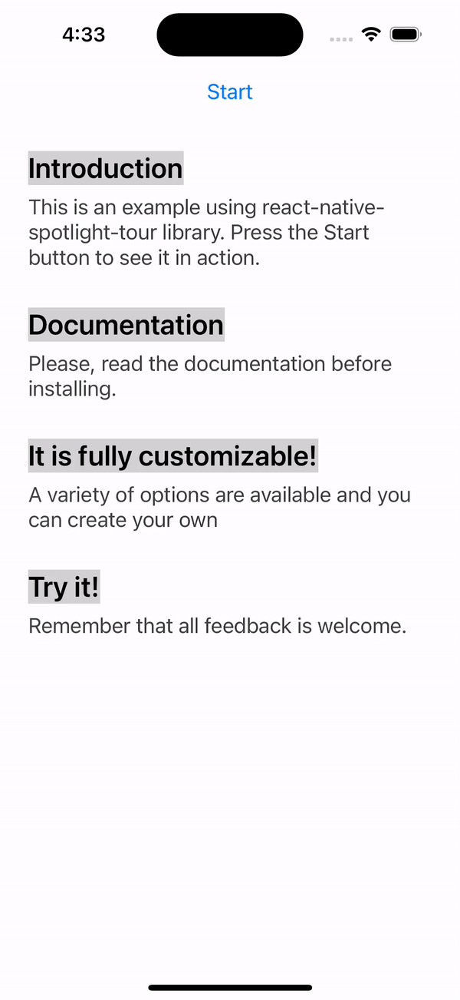

# React Native Spotlight Tour
<!-- ALL-CONTRIBUTORS-BADGE:START - Do not remove or modify this section -->
[](#contributors-)
<!-- ALL-CONTRIBUTORS-BADGE:END -->

[](https://github.com/stackbuilders/react-native-spotlight-tour/actions/workflows/ci.yml)
[](https://github.com/stackbuilders/react-native-spotlight-tour/actions/workflows/release.yml)
[](https://www.npmjs.com/package/@stackbuilders/react-native-spotlight-tour)
[](https://www.npmjs.com/package/@stackbuilders/react-native-spotlight-tour)
[](./LICENSE)
[](https://github.com/stackbuilders/react-native-spotlight-tour/releases)
[](https://snyk.io/)

`react-native-spotlight-tour` is a simple and intuitive library for React Native (Android, iOS, and Web 
compatible). It allows you to implement a highly customizable tour feature with an awesome spotlight 
effect. This library handles animations at the native level and is perfect for the following:

* Guiding users on how to use your application
* Showing an introduction to your users

<span></span>
<span></span>
<span></span>

## Requirements

* [ReactJS](https://reactjs.org/) >= 16.8.0
* [React Native](https://reactnative.dev/) >= 0.50.0
* [react-native-svg](https://github.com/react-native-svg/react-native-svg) >= 12.1.0

## Install

With `npm`:

```bash
$ npm install @stackbuilders/react-native-spotlight-tour
```

With `yarn`:

```bash
$ yarn add @stackbuilders/react-native-spotlight-tour
```

## Usage

To be able to use the tour, you'll need to wrap everything around a `SpotlightTourProvider`. This provider component will also give you access to a hook to retrieve the `SpotlightTour` context, which gives information and fine control over the tour.

```tsx
import { AttachStep, SpotlightTourProvider, TourStep } from "@stackbuilders/react-native-spotlight-tour";

const mySteps: TourStep[] = [
  // ...
];

return (
  <SpotlightTourProvider steps={mySteps} overlayColor={"gray"} overlayOpacity={0.36}>
    {({ start }) => (
      <>
        <Button title="Start" onPress={start} />

        <View>
          <AttachStep index={0}>
            <Text>Introduction</Text>
          </AttachStep>

          <Text>
            This is an example using the spotlight-tour library.
            Press the Start button to see it in action.
          </Text>
        </View>

        <View>
          <AttachStep index={1}>
            <TitleText>Documentation</TitleText>
          </AttachStep>
          <DescriptionText>
            Please, read the documentation before installing.
          </DescriptionText>
        </View>
      </>
    )};
  </SpotlightTourProvider>
);
```

The tour requires an array of steps to be configured, which will map directly to each `<AttachStep />` index. Bellow is a complete example of a `TourStep` array:

```tsx
import {
  Align,
  Position,
  TourStep,
  useSpotlightTour
} from "@stackbuilders/react-native-spotlight-tour";

const mySteps: TourStep[] = [{
  alignTo: Align.SCREEN,
  position: Position.BOTTOM,
  render: ({ next }) => (
    <View>
      <Text>This is the first step of tour!</Text>
      <Button title="Next" onPress={next} />
    </View>
  )
}, {
  alignTo: Align.SPOT,
  before: () => {
    return DataService.fetchData()
      .then(setData);
  },
  position: Position.RIGHT,
  render: () => {
    // You can also use the hook inside the step component!
    const { previous, stop } = useSpotlightTour();

    return (
      <View>
        <Text>This is the first step of tour!</Text>
        <Button title="Previous" onPress={previous} />
        <Button title="Stop" onPress={stop} />
      </View>
    );
  }
}];
```

You can also find a complete example [here](example/).

## API Reference

To view all the types, options, and props, please check the complete [API Reference](https://stackbuilders.github.io/react-native-spotlight-tour/docs/build/) documentation.

## Contributing

Do you want to contribute to this project? Please take a look at our [contributing guideline](/docs/CONTRIBUTING.md) to know how you can help us build it.

---
</img>  
[Check out our libraries](https://github.com/stackbuilders/) | [Join our team](https://www.stackbuilders.com/join-us/)

## Contributors ✨

Thanks goes to these wonderful people ([emoji key](https://allcontributors.org/docs/en/emoji-key)):

<!-- ALL-CONTRIBUTORS-LIST:START - Do not remove or modify this section -->
<!-- prettier-ignore-start -->
<!-- markdownlint-disable -->
<table>
  <tbody>
    <tr>
      <td align="center" valign="top" width="14.28%"><a href="https://github.com/JoseLion"><br /><sub><b>Jose Luis Leon</b></sub></a><br /><a href="https://github.com/stackbuilders/react-native-spotlight-tour/commits?author=JoseLion" title="Code">💻</a> <a href="https://github.com/stackbuilders/react-native-spotlight-tour/commits?author=JoseLion" title="Tests">⚠️</a> <a href="https://github.com/stackbuilders/react-native-spotlight-tour/commits?author=JoseLion" title="Documentation">📖</a> <a href="#infra-JoseLion" title="Infrastructure (Hosting, Build-Tools, etc)">🚇</a> <a href="#maintenance-JoseLion" title="Maintenance">🚧</a> <a href="https://github.com/stackbuilders/react-native-spotlight-tour/pulls?q=is%3Apr+reviewed-by%3AJoseLion" title="Reviewed Pull Requests">👀</a></td>
      <td align="center" valign="top" width="14.28%"><a href="https://github.com/sestrella"><br /><sub><b>Sebastián Estrella</b></sub></a><br /><a href="#infra-sestrella" title="Infrastructure (Hosting, Build-Tools, etc)">🚇</a></td>
      <td align="center" valign="top" width="14.28%"><a href="https://github.com/rojasTob"><br /><sub><b>Angie Rojas</b></sub></a><br /><a href="https://github.com/stackbuilders/react-native-spotlight-tour/commits?author=rojasTob" title="Code">💻</a> <a href="https://github.com/stackbuilders/react-native-spotlight-tour/commits?author=rojasTob" title="Documentation">📖</a></td>
      <td align="center" valign="top" width="14.28%"><a href="http://ferandrade.com/"><br /><sub><b>Fernanda Andrade</b></sub></a><br /><a href="#infra-flandrade" title="Infrastructure (Hosting, Build-Tools, etc)">🚇</a> <a href="https://github.com/stackbuilders/react-native-spotlight-tour/commits?author=flandrade" title="Tests">⚠️</a></td>
      <td align="center" valign="top" width="14.28%"><a href="https://www.tivodeveloper.tech/"><br /><sub><b>Steven Cuasqui</b></sub></a><br /><a href="https://github.com/stackbuilders/react-native-spotlight-tour/commits?author=StevenCuasqui" title="Documentation">📖</a></td>
      <td align="center" valign="top" width="14.28%"><a href="https://github.com/Alex0jk"><br /><sub><b>Alexander Mejía</b></sub></a><br /><a href="https://github.com/stackbuilders/react-native-spotlight-tour/commits?author=Alex0jk" title="Code">💻</a></td>
      <td align="center" valign="top" width="14.28%"><a href="https://github.com/lopenchi"><br /><sub><b>Carolina López</b></sub></a><br /><a href="https://github.com/stackbuilders/react-native-spotlight-tour/commits?author=lopenchi" title="Code">💻</a> <a href="#example-lopenchi" title="Examples">💡</a></td>
    </tr>
    <tr>
      <td align="center" valign="top" width="14.28%"><a href="https://github.com/ChristianMarca"><br /><sub><b>cmarcag</b></sub></a><br /><a href="https://github.com/stackbuilders/react-native-spotlight-tour/commits?author=ChristianMarca" title="Tests">⚠️</a></td>
      <td align="center" valign="top" width="14.28%"><a href="https://github.com/krarrobo1"><br /><sub><b>Ricardo Arrobo</b></sub></a><br /><a href="https://github.com/stackbuilders/react-native-spotlight-tour/commits?author=krarrobo1" title="Code">💻</a> <a href="https://github.com/stackbuilders/react-native-spotlight-tour/commits?author=krarrobo1" title="Documentation">📖</a></td>
      <td align="center" valign="top" width="14.28%"><a href="https://abkal.vercel.app/"><br /><sub><b>Mohammad Abkal</b></sub></a><br /><a href="https://github.com/stackbuilders/react-native-spotlight-tour/commits?author=mohamedabkal" title="Documentation">📖</a></td>
      <td align="center" valign="top" width="14.28%"><a href="https://github.com/Enneson"><br /><sub><b>Alexander Pokhil</b></sub></a><br /><a href="https://github.com/stackbuilders/react-native-spotlight-tour/commits?author=Enneson" title="Code">💻</a></td>
    </tr>
  </tbody>
  <tfoot>
    <tr>
      <td align="center" size="13px" colspan="7">
        
          <a href="https://all-contributors.js.org/docs/en/bot/usage">Add your contributions</a>
        </img>
      </td>
    </tr>
  </tfoot>
</table>

<!-- markdownlint-restore -->
<!-- prettier-ignore-end -->

<!-- ALL-CONTRIBUTORS-LIST:END -->

This project follows the [all-contributors](https://github.com/all-contributors/all-contributors) specification. Contributions of any kind welcome!

## License

MIT, see [the LICENSE file](LICENSE).
