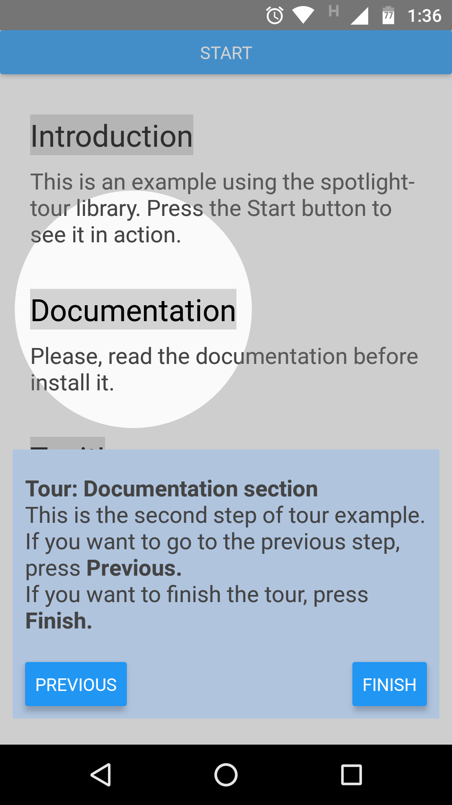

# react-native-spotlight-tour
For React Native applications. This library allows you to implement a highly customizable application tour feature with an awesome spotlight effect.



## Requirements
* react >= 16.8.0
* react-native >= 0.50.0
* react-native-svg >= 12.1.0

## Installation
* Using `npm`

    ```sh
    $ npm install react-native-spotlight-tour
    ```
* Using `yarn`

    ```sh
    $ yarn add react-native-spotlight-tour
    ```

## Basic usage

The `SpotlightTourProvider` allows you to wrap a section of the app that you want to implement a tour. This provider receives the following properties:

| Prop | Description |
| ------ | ------ |
|ref| Defines a mutable object for the Tour. This object will be populated through the provider. It is optional.|
|steps| Receives an array of `TourStep`. This array will have the steps for the tour application. [Here](#setting-tour-steps) you can find more info about it.|
|overlayColor| Defines a color for the overlay. The value could be a string, number or rgbaArray. This property is optional and the color `black` is defined by default. |
|overlayOpacity| Defines the opacity of the overlay. The value could be a number or strieng. This property is optional and the value `0.45` is defined by default. |

Also, the library expose the following methods:

|Method| Description |
| ------ | ------ |
|start| To begin the tour. |
|next| To navigate to the next defined step. |
|previus| To navigate to the previous step.|
|stop| To finish the tour.|


The `AttachStep` helps to wrap a part of the code that the tour will circle and display the effect. It receives the following properties:

| Prop | Description |
| ------ | ------ |
| index | Receives a number. It defines de number of secuence wich the area should be circle. |
| disabled | It is an optional prop and receives a boolean. It defines if the circled area should be displayed or not. The value `false` is defined by default. |


Example:

```jsx
import {
  AttachStep,
  SpotlightTourProvider
} from 'react-native-spotligh-tour'

...
return (
   <SpotlightTourProvider
      steps={getTourSteps}
      overlayColor={"gray"}
      overlayOpacity={0.36}
    >
      {({start}) => (
        <>
          <Button title="Start" onPress={start}/>
          <SectionContainerView>
            <AttachStep index={0}>
              <TitleText>Introduction</TitleText>
            </AttachStep>
            <DescriptionText>
              This is an example using the spotlight-tour library.
              Press the Start button to see it in action.
            </DescriptionText>
          </SectionContainerView>
          <SectionContainerView>
            <AttachStep index={1}>
              <TitleText>Documentation</TitleText>
            </AttachStep>
            <DescriptionText>
              Please, read the documentation before install it.
            </DescriptionText>
          </SectionContainerView>
          ...
      );
    </SpotlightTourProvider>
```

### Setting Tour Steps

The `TourStep` type has the following properties: `alignTo`, `position` and `render`. To set the `alignTo` and `position` properties you could use the following enums which are exported by the library:
* `Align`: has `SCREEN` and `SPOT` values.
* `Position`: has `BOTTOM`, `LEFT`, `RIGHT` and `TOP` values.

The `render` property receives a function that returns a component. Example:

```jsx
import {
  Align,
  Position,
  TourStep,
  useSpotlightTour
} from "react-native-spotlight-tour";

const getTourSteps: TourStep[]=
    [
      {
        alignTo: Align.SCREEN,
        position: Position.BOTTOM,
        render: (props) => {
          const {next}=useSpotlightTour();
          return (
            <SpotDescriptionView>
              <DescriptionText>
                <BoldText>Tour: Intro section {"\n"}</BoldText>
                This is the first step of tour example.
                If you want to go to the next step, please press <BoldText>Next</BoldText>
              </DescriptionText>
              <ButtonsGroupView>
                <Button title="Next" onPress={next}/>
              </ButtonsGroupView>
            </SpotDescriptionView>
          );
        },
      },
      {
        alignTo: Align.SCREEN,
        position: Position.BOTTOM,
        render: (props) => {
          const {previous, stop}=useSpotlightTour();
          return (
            <SpotDescriptionView>
              <DescriptionText>
                <BoldText>Tour: Documentation section {"\n"}</BoldText>
                This is the second step of tour example. {"\n"}
                If you want to go to the previous step, press <BoldText>Previous. {"\n"}</BoldText>
                If you want to finish the tour, press <BoldText>Finish. {"\n"}</BoldText>
              </DescriptionText>
              <ButtonsGroupView>
                <Button title="Previous" onPress={previous}/>
                <Button title="Finish" onPress={stop}/>
              </ButtonsGroupView>
            </SpotDescriptionView>
          );
        },
      }
    ];

```

You could see the complete code [here](example)


## Contributing

Contributions are always welcome! If you are interested in contribuiting, please checkout our [Conduct Code](CODE_OF_CONDUCT).

## License

[MIT License](LICENSE).
