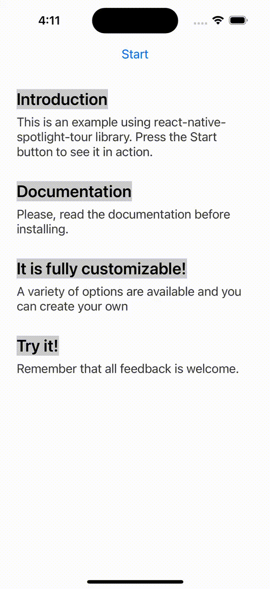

# React Native Spotlight Tour
<!-- ALL-CONTRIBUTORS-BADGE:START - Do not remove or modify this section -->
[](#contributors-)
<!-- ALL-CONTRIBUTORS-BADGE:END -->

[](https://github.com/stackbuilders/react-native-spotlight-tour/actions/workflows/ci.yml)
[](https://github.com/stackbuilders/react-native-spotlight-tour/actions/workflows/release.yml)
[](https://www.npmjs.com/package/react-native-spotlight-tour)
[](https://www.npmjs.com/package/react-native-spotlight-tour)
[](https://github.com/stackbuilders/react-native-spotlight-tour/blob/main/LICENSE)
[](https://github.com/stackbuilders/react-native-spotlight-tour/releases)
[](https://snyk.io/test/github/stackbuilders/react-native-spotlight-tour)

`react-native-spotlight-tour` is a simple and intuitive library for React Native (Android, iOS, and Web
compatible). It uses [Floating UI](https://floating-ui.com) under the hood in order to handle elements
positioning, it re-exports all floating-ui middlewares to be configured in the tour.
It also allows you to implement a highly customizable tour feature with an awesome spotlight effect.
This library handles animations at the native level and is perfect
for the following:

- Guiding users on how to use your application
- Showing an introduction to your users

<span></span>
<span></span>
<span></span>
<span></span>

## Requirements

- [ReactJS](https://reactjs.org/) >= 16.8.0
- [React Native](https://reactnative.dev/) >= 0.50.0
- [react-native-svg](https://github.com/react-native-svg/react-native-svg) >= 12.1.0

## Install

With `npm`:

```bash
npm install react-native-spotlight-tour
```

With `yarn`:

```bash
yarn add react-native-spotlight-tour
```

## 🚨 Breaking changes: v2 to v3

This major update brings a few fixes, some great new features, and some breaking changes. These are some highlight you'll need to consider while upgrading from v2 to v3:

- The package has been renamed from `@stackbuilders/react-native-spotlight-tour` to just `react-native-spotlight-tour`
  - Don't worry, this library is still developed and maintained by the [Stack Builders Inc.](https://www.stackbuilders.com/) team!
  - Remove the former package from your dependencies and use the command described in the [Install section](#install)
  - Rename any import from the previous name to use just `react-native-spotlight-tour` instead
- Tooltip positioning was refactored
  - Props related to the tooltip position were removed from `SpotlightTourProvider` and the `TourStep` object.
    - Both `Align` and `Position` enums were removed
    - Both `alignTo` and `position` props were removed
  - We now delegate the positioning to [FloatingUI](https://floating-ui.com/), so you can use the `floatingProps` prop to configure its global behavior or granularly on each step.
  - Middleware functions are re-exported from `@floating-ui/react-native` to `react-native-spotlight-tour`.
  - You may not need to do changes on `floatingProps` since the default behavior is very similar to v2

## Usage

To be able to use the tour, you'll need to wrap everything around a `SpotlightTourProvider`. This provider component will also give you access to a hook to retrieve the `SpotlightTour` context, which gives information and fine control over the tour.

```tsx
import { Button, Text, View } from "react-native";
import {
  AttachStep,
  SpotlightTourProvider,
  TourStep,
  flip,
  offset,
  shift,
} from "react-native-spotlight-tour";

const mySteps: TourStep[] = [
  // ...setup the steps
];

return (
  <SpotlightTourProvider
    steps={mySteps}
    overlayColor={"gray"}
    overlayOpacity={0.36}
    // This configurations will apply to all steps
    floatingProps={{
      middleware:[offset(5), shift(), flip()],
      placement: "bottom",
    }}
  >
    {({ start }) => (
      <>
        <Button title="Start" onPress={start} />

        <View>
          <AttachStep index={0}>
            <Text>Introduction</Text>
          </AttachStep>

          <Text>
            This is an example using the spotlight-tour library.
            Press the Start button to see it in action.
          </Text>
        </View>

        <View>
          <AttachStep index={1}>
            <Text>Documentation</Text>
          </AttachStep>
          <DescriptionText>
            Please, read the documentation before installing.
          </DescriptionText>
        </View>
      </>
    )};
  </SpotlightTourProvider>
);
```

Floating-UI props can be defined in the `<SpotlightTourProvider/>` and this will be applied to all tour steps. If no configuration is given it will take a default with the next values:
`middlewares: [flip(), offset(4), shift()]` and `placement: "bottom"`.

The tour requires an array of steps to be configured, which will map directly to each `<AttachStep />` index. Bellow is a complete example of a `TourStep` array:

```tsx
import { Button, Text, View } from "react-native";
import {
  Align,
  TourStep,
  useSpotlightTour
} from "react-native-spotlight-tour";

const mySteps: TourStep[] = [{
  // This configurations will apply just for this step
  floatingProps:{
    middleware: [offset(0), shift(), flip()],
    placement: "right",
  },
  render: ({ next }) => (
    <View>
      <Text>This is the first step of tour!</Text>
      <Button title="Next" onPress={next} />
    </View>
  )
}, {
  before: () => {
    return DataService.fetchData()
      .then(setData);
  },
  render: () => {
    // You can also use the hook inside the step component!
    const { previous, stop } = useSpotlightTour();

    return (
      <View>
        <Text>This is the first step of tour!</Text>
        <Button title="Previous" onPress={previous} />
        <Button title="Stop" onPress={stop} />
      </View>
    );
  }
}];
```

Floating-UI props can be defined in each step for a custom configuration. If no floating configuration is specified in the step it will take the one defined in the `<SpotlightTourProvider/>`.

You can also find a complete example [here](example/).

## Built-in Helper Components

You can take advantage of the built-in customizable components. For example, our [TourBox](https://stackbuilders.github.io/react-native-spotlight-tour/docs/build/#tourbox) component can be used as a tooltip container for each step.


```tsx
import { Text } from "react-native";
import { Align, TourBox, TourStep } from "react-native-spotlight-tour";

const tourSteps: TourStep[] = [{
    render: props => (
      <TourBox
        title="Tour: Customization"
        titleStyle={{
          fontFamily: 'Roboto',
          color: '#90EE90',
          fontWeight: 'bold'
        }}
        backText="Previous"
        nextText="Next"
        {...props}
      >
        <Text>
          {"This is the third step of tour example.\n"}
          {"If you want to go to the next step, please press "}<BoldText>{"Next.\n"}</BoldText>
          {"If you want to go to the previous step, press "}<BoldText>{"Previous.\n"}</BoldText>
        </Text>
      </TourBox>
    ),
  }];
```

### Tour customization

The [SpotlightTourProvider](https://stackbuilders.github.io/react-native-spotlight-tour/docs/build/#spotlighttourprovider) also allows you to customize the overlay through the [overlayColor](https://stackbuilders.github.io/react-native-spotlight-tour/docs/build/interfaces/SpotlightTourProviderProps.html#overlaycolor) and [overlayOpacity](https://stackbuilders.github.io/react-native-spotlight-tour/docs/build/interfaces/SpotlightTourProviderProps.html#overlayopacity) props.

```tsx
import { AttachStep, SpotlightTourProvider, TourStep } from "react-native-spotlight-tour";

const mySteps: TourStep[] = [
  // ...
];

return (
  <SpotlightTourProvider steps={mySteps} overlayColor={"gray"} overlayOpacity={0.36}>
    {({ start }) => (
      <>
      {/* ... */}
      </>
    )};
  </SpotlightTourProvider>
);
```

Besides above customizations, you can also define the transition animation [see motion](https://stackbuilders.github.io/react-native-spotlight-tour/docs/build/#motion) and the behavior when the user presses the backdrop [see onBackdropPress](https://stackbuilders.github.io/react-native-spotlight-tour/docs/build/#backdroppressbehavior). Otherwise if you wish to make them different for an specific step you could override this properties in the `TourStep` configuration.

```tsx
import { Button, Text, View } from "react-native";
import {
  Align
  AttachStep,
  SpotlightTourProvider,
  TourStep,
  TourBox
} from "react-native-spotlight-tour";

const tourSteps: TourStep[] = [{
    motion: "fade",
    onBackdropPress: "stop",
    render: props => (
      <TourBox
        title="Tour: Customization"
        backText="Previous"
        nextText="Next"
        {...props}
      >
        <Text>
          {"This is the first step of tour example.\n"}
          {"If you want to go to the next step, please press "}<BoldText>{"Next.\n"}</BoldText>
          {"If you want to go to the previous step, press "}<BoldText>{"Previous.\n"}</BoldText>
        </Text>
      </TourBox>
    ),
  }];

return (
  <SpotlightTourProvider
    steps={tourSteps}
    overlayColor={"gray"}
    overlayOpacity={0.36}
    onBackdropPress="continue"
    motion="bounce"
  >
    {({ start }) => (
      <>
      <Button title="Start" onPress={start} />

       <View>
          <AttachStep index={0}>
            <Text>Introduction</Text>
          </AttachStep>

          <Text>
            This is an example using the spotlight-tour library.
            Press the Start button to see it in action.
          </Text>
        </View>
      </>
    )};
  </SpotlightTourProvider>
);
```

## API Reference

To view all the types, options, and props, please check the complete [API Reference](https://stackbuilders.github.io/react-native-spotlight-tour/docs/build/) documentation.

## Contributing

Do you want to contribute to this project? Please take a look at our [contributing guideline](/docs/CONTRIBUTING.md) to know how you can help us build it.

---
</img>
[Check out our libraries](https://github.com/stackbuilders/) | [Join our team](https://www.stackbuilders.com/join-us/)

## Contributors ✨

Thanks goes to these wonderful people ([emoji key](https://allcontributors.org/docs/en/emoji-key)):

<!-- ALL-CONTRIBUTORS-LIST:START - Do not remove or modify this section -->
<!-- prettier-ignore-start -->
<!-- markdownlint-disable -->
<table>
  <tbody>
    <tr>
      <td align="center" valign="top" width="14.28%"><a href="https://github.com/JoseLion"><br /><sub><b>Jose Luis Leon</b></sub></a><br /><a href="https://github.com/stackbuilders/react-native-spotlight-tour/commits?author=JoseLion" title="Code">💻</a> <a href="https://github.com/stackbuilders/react-native-spotlight-tour/commits?author=JoseLion" title="Tests">⚠️</a> <a href="https://github.com/stackbuilders/react-native-spotlight-tour/commits?author=JoseLion" title="Documentation">📖</a> <a href="#infra-JoseLion" title="Infrastructure (Hosting, Build-Tools, etc)">🚇</a> <a href="#maintenance-JoseLion" title="Maintenance">🚧</a> <a href="https://github.com/stackbuilders/react-native-spotlight-tour/pulls?q=is%3Apr+reviewed-by%3AJoseLion" title="Reviewed Pull Requests">👀</a></td>
      <td align="center" valign="top" width="14.28%"><a href="https://github.com/sestrella"><br /><sub><b>Sebastián Estrella</b></sub></a><br /><a href="#infra-sestrella" title="Infrastructure (Hosting, Build-Tools, etc)">🚇</a></td>
      <td align="center" valign="top" width="14.28%"><a href="https://github.com/rojasTob"><br /><sub><b>Angie Rojas</b></sub></a><br /><a href="https://github.com/stackbuilders/react-native-spotlight-tour/commits?author=rojasTob" title="Code">💻</a> <a href="https://github.com/stackbuilders/react-native-spotlight-tour/commits?author=rojasTob" title="Documentation">📖</a></td>
      <td align="center" valign="top" width="14.28%"><a href="http://ferandrade.com/"><br /><sub><b>Fernanda Andrade</b></sub></a><br /><a href="#infra-flandrade" title="Infrastructure (Hosting, Build-Tools, etc)">🚇</a> <a href="https://github.com/stackbuilders/react-native-spotlight-tour/commits?author=flandrade" title="Tests">⚠️</a></td>
      <td align="center" valign="top" width="14.28%"><a href="https://www.tivodeveloper.tech/"><br /><sub><b>Steven Cuasqui</b></sub></a><br /><a href="https://github.com/stackbuilders/react-native-spotlight-tour/commits?author=StevenCuasqui" title="Documentation">📖</a></td>
      <td align="center" valign="top" width="14.28%"><a href="https://github.com/Alex0jk"><br /><sub><b>Alexander Mejía</b></sub></a><br /><a href="https://github.com/stackbuilders/react-native-spotlight-tour/commits?author=Alex0jk" title="Code">💻</a></td>
      <td align="center" valign="top" width="14.28%"><a href="https://github.com/lopenchi"><br /><sub><b>Carolina López</b></sub></a><br /><a href="https://github.com/stackbuilders/react-native-spotlight-tour/commits?author=lopenchi" title="Code">💻</a> <a href="#example-lopenchi" title="Examples">💡</a></td>
    </tr>
    <tr>
      <td align="center" valign="top" width="14.28%"><a href="https://github.com/ChristianMarca"><br /><sub><b>cmarcag</b></sub></a><br /><a href="https://github.com/stackbuilders/react-native-spotlight-tour/commits?author=ChristianMarca" title="Tests">⚠️</a></td>
      <td align="center" valign="top" width="14.28%"><a href="https://github.com/krarrobo1"><br /><sub><b>Ricardo Arrobo</b></sub></a><br /><a href="https://github.com/stackbuilders/react-native-spotlight-tour/commits?author=krarrobo1" title="Code">💻</a> <a href="https://github.com/stackbuilders/react-native-spotlight-tour/commits?author=krarrobo1" title="Documentation">📖</a></td>
      <td align="center" valign="top" width="14.28%"><a href="https://abkal.vercel.app/"><br /><sub><b>Mohammad Abkal</b></sub></a><br /><a href="https://github.com/stackbuilders/react-native-spotlight-tour/commits?author=mohamedabkal" title="Documentation">📖</a></td>
      <td align="center" valign="top" width="14.28%"><a href="https://github.com/Enneson"><br /><sub><b>Alexander Pokhil</b></sub></a><br /><a href="https://github.com/stackbuilders/react-native-spotlight-tour/commits?author=Enneson" title="Code">💻</a></td>
      <td align="center" valign="top" width="14.28%"><a href="https://github.com/alejo0o"><br /><sub><b>Alejandro Vivanco</b></sub></a><br /><a href="https://github.com/stackbuilders/react-native-spotlight-tour/commits?author=alejo0o" title="Code">💻</a> <a href="https://github.com/stackbuilders/react-native-spotlight-tour/pulls?q=is%3Apr+reviewed-by%3Aalejo0o" title="Reviewed Pull Requests">👀</a></td>
      <td align="center" valign="top" width="14.28%"><a href="https://github.com/well1791"><br /><sub><b>Wellington Mendoza</b></sub></a><br /><a href="https://github.com/stackbuilders/react-native-spotlight-tour/pulls?q=is%3Apr+reviewed-by%3Awell1791" title="Reviewed Pull Requests">👀</a></td>
      <td align="center" valign="top" width="14.28%"><a href="https://github.com/ChristianSama"><br /><sub><b>Christian Samaniego</b></sub></a><br /><a href="https://github.com/stackbuilders/react-native-spotlight-tour/pulls?q=is%3Apr+reviewed-by%3AChristianSama" title="Reviewed Pull Requests">👀</a></td>
    </tr>
    <tr>
      <td align="center" valign="top" width="14.28%"><a href="https://github.com/beKoool"><br /><sub><b>beKool.sh</b></sub></a><br /><a href="https://github.com/stackbuilders/react-native-spotlight-tour/commits?author=beKoool" title="Documentation">📖</a></td>
      <td align="center" valign="top" width="14.28%"><a href="https://github.com/alxpkhl"><br /><sub><b>Alexander Pokhil</b></sub></a><br /><a href="https://github.com/stackbuilders/react-native-spotlight-tour/commits?author=alxpkhl" title="Code">💻</a></td>
      <td align="center" valign="top" width="14.28%"><a href="https://ravan.me"><br /><sub><b>Ravan Scafi</b></sub></a><br /><a href="https://github.com/stackbuilders/react-native-spotlight-tour/commits?author=ravanscafi" title="Code">💻</a></td>
      <td align="center" valign="top" width="14.28%"><a href="https://github.com/anddriex"><br /><sub><b>Andres Perez</b></sub></a><br /><a href="https://github.com/stackbuilders/react-native-spotlight-tour/commits?author=anddriex" title="Code">💻</a></td>
      <td align="center" valign="top" width="14.28%"><a href="https://github.com/hdbv95"><br /><sub><b>David Baldassari</b></sub></a><br /><a href="https://github.com/stackbuilders/react-native-spotlight-tour/commits?author=hdbv95" title="Code">💻</a></td>
    </tr>
  </tbody>
  <tfoot>
    <tr>
      <td align="center" size="13px" colspan="7">
        
          <a href="https://all-contributors.js.org/docs/en/bot/usage">Add your contributions</a>
        </img>
      </td>
    </tr>
  </tfoot>
</table>

<!-- markdownlint-restore -->
<!-- prettier-ignore-end -->

<!-- ALL-CONTRIBUTORS-LIST:END -->

This project follows the [all-contributors](https://github.com/all-contributors/all-contributors) specification. Contributions of any kind welcome!

## License

MIT, see [the LICENSE file](LICENSE).
