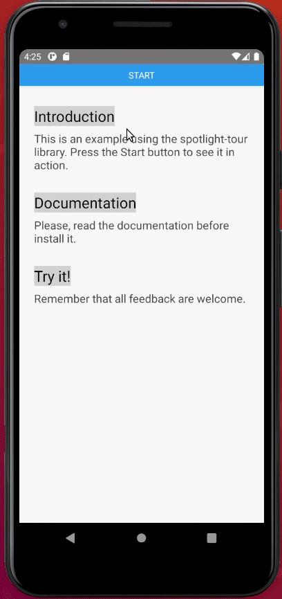

# react-native-spotlight-tour
`react-native-spotlight-tour` is a simple and intuitive library for React Native (Android and iOS 
compatible). It allows you to implement a highly customizable tour feature with an awesome 
spotlight effect. This library is perfect for the following:

- Guiding users on how to use your application
- Showing an introduction to your users



## Requirements
* react >= 16.8.0
* react-native >= 0.50.0
* react-native-svg >= 12.1.0

## Installation
* Using `npm`

    ```sh
    $ npm install react-native-spotlight-tour
    ```
* Using `yarn`

    ```sh
    $ yarn add react-native-spotlight-tour
    ```

## Basic usage

```jsx
import {
  AttachStep,
  SpotlightTourProvider
} from 'react-native-spotligh-tour'

...
   <SpotlightTourProvider
      steps={getTourSteps}
      overlayColor={"gray"}
      overlayOpacity={0.36}
    >
      {({ start }) => (
        <>
          <Button title="Start" onPress={start} />

          <SectionContainerView>
            <AttachStep index={0}>
              <TitleText>Introduction</TitleText>
            </AttachStep>
            <DescriptionText>
              This is an example using the spotlight-tour library.
              Press the Start button to see it in action.
            </DescriptionText>
          </SectionContainerView>
          <SectionContainerView>
            <AttachStep index={1}>
              <TitleText>Documentation</TitleText>
            </AttachStep>
            <DescriptionText>
              Please, read the documentation before install it.
            </DescriptionText>
          </SectionContainerView>
          ...
      );
    </SpotlightTourProvider>
```

### SpotlightTourProvider

The `SpotlightTourProvider` provider allows you to wrap a section of the application to implement 
the spotlight tour. In this section, you define a component that will trigger the tour sequence. 
For example, a button with an `onPress` handler that will allow you to call the provided `start()` 
method to start the tour workflow. To customize and set up this workflow, you should pass a list 
of `steps` to the `SpotlightTourProvider` provider. 
[Check out the tour steps section](#setting-tour-steps) for more details.

Once the tour starts, an overlay component will be shown to highlight a component from the section.
This library shows an overlay component that darkens other UI elements on the screen so that users 
can focus on the children's components of `AttachStep`.


| Prop | Required? | Default | Description |
| ---- | --------- | ------- | ----------- |
|`ref`| No | N/A | Mutable object for the Tour. Populated through the provider.|
|`steps`| Yes | N/A | Steps for the tour (array of `TourStep`).|
|`overlayColor`| No | `black` | Color for the overlay (`String`, `Number` or `rgbaArray`).|
|`overlayOpacity`| No | `0.45` | Opacity of the overlay (`Number` or `String`) |


|Method| Description |
| ------ | ------ |
|`start`| Begin the tour. |
|`next`| Navigate to the next defined step. |
|`previous`| Navigate to the previous step. |
|`stop`| Finish the tour. |

### AttachStep

The `AttachStep` wraps the components that will be highlighted by the library. It receives the 
following properties:

| Prop | Required? | Default | Description |
| -----| --------- |-------- | ----------- |
| `index` | Yes | N/A | Defines the order for the tour sequence (`Number`). |
| `disabled` | No | `false` | Defines if the library should highlight the component or not (`Boolean`). |


### Setting Tour Steps

The `TourStep` creates a small box with the information you want to display for each step in the tour. 
This type has the following properties: `alignTo`, `position` and `render`. To set the `alignTo` and 
`position` properties you could use the following enums which are exported by the library:
* `Align`: has `SCREEN` and `SPOT` values.
* `Position`: has `BOTTOM`, `LEFT`, `RIGHT` and `TOP` values.

The `render` property receives a function that returns a component. Example:

```jsx
import {
  Align,
  Position,
  TourStep,
  useSpotlightTour
} from "react-native-spotlight-tour";

...
const getTourSteps: TourStep[] =
    [
      {
        alignTo: Align.SCREEN,
        position: Position.BOTTOM,
        render: () => {
          const { next } = useSpotlightTour();
          return (
            <SpotDescriptionView>
              <DescriptionText>
                <BoldText>{"Tour: Intro section \n"}</BoldText>
                {"This is the first step of tour example. \nIf you want to go to the next step, please press"}
                <BoldText>Next</BoldText>
              </DescriptionText>
              <ButtonsGroupView>
                <Button title="Next" onPress={next} />
              </ButtonsGroupView>
            </SpotDescriptionView>
          );
        },
      },
      {
        alignTo: Align.SCREEN,
        position: Position.BOTTOM,
        render: () => {
          const { previous, stop } = useSpotlightTour();
          return (
            <SpotDescriptionView>
              <DescriptionText>
                <BoldText>{"Tour: Documentation section \n"}</BoldText>
                {"This is the second step of tour example. \nIf you want to go to the previous step, press"}
                <BoldText>{"Previous. \n"}</BoldText>
                If you want to finish the tour, press <BoldText>{"Finish. \n"}</BoldText>
              </DescriptionText>
              <ButtonsGroupView>
                <Button title="Previous" onPress={previous} />
                <Button title="Finish" onPress={stop} />
              </ButtonsGroupView>
            </SpotDescriptionView>
          );
        },
      }
    ];

...
```

Check out the complete example [here](example/).


## Contributing

Contributions are always welcome! If you are interested in contribuiting, please checkout our [Conduct Code](CODE_OF_CONDUCT.md).

To run the library code locally, please consider the following versions:
- nodejs >= 14.7.0
- yarn >= 1.22.4

## License

[MIT License](LICENSE).
